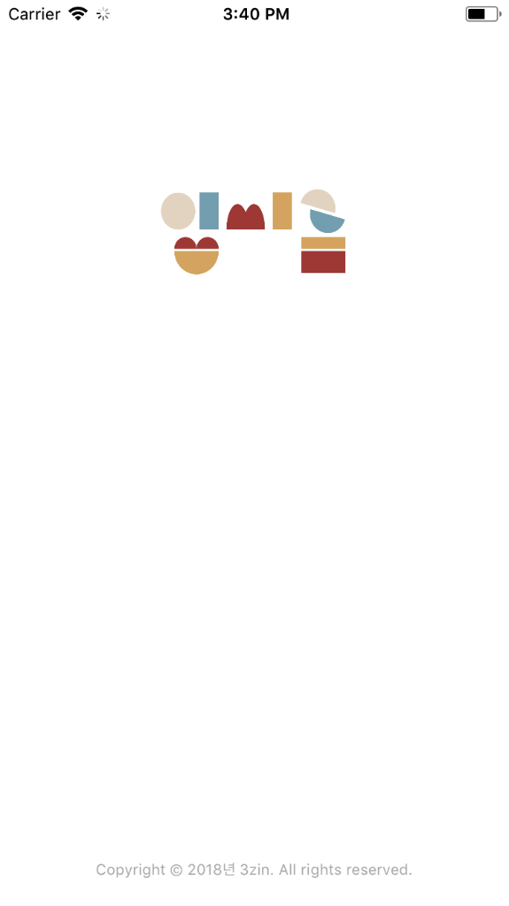
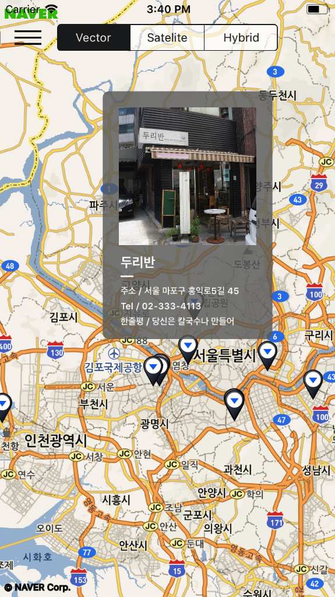
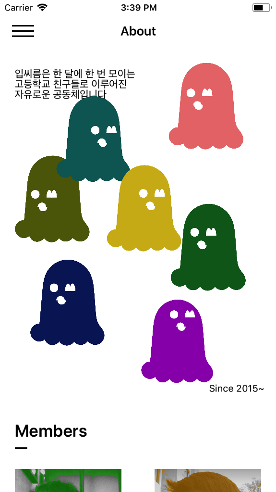
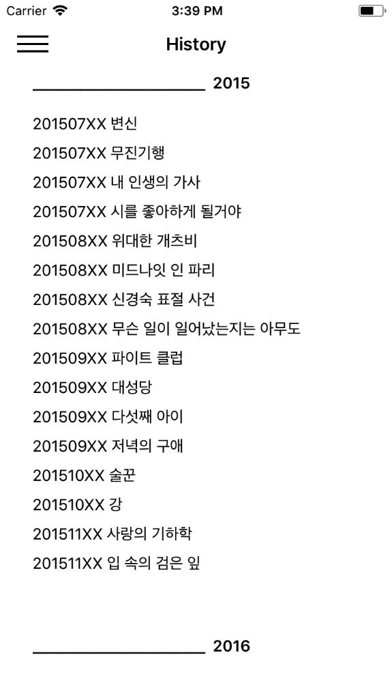
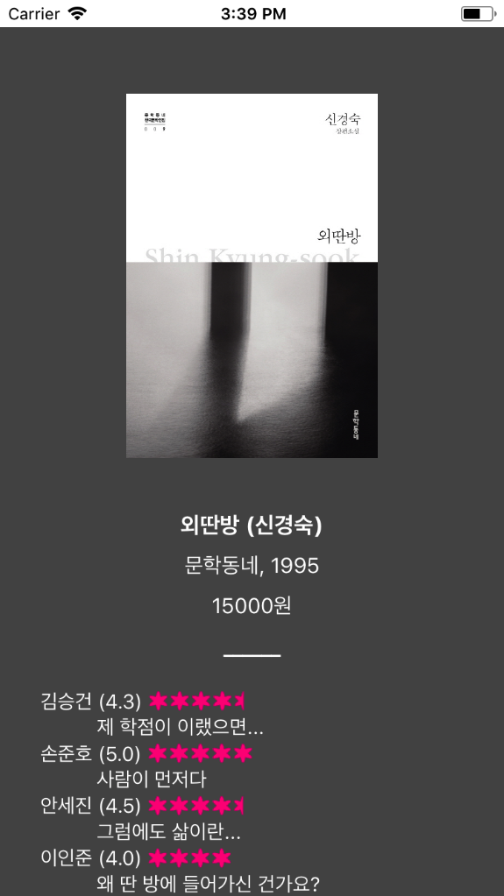
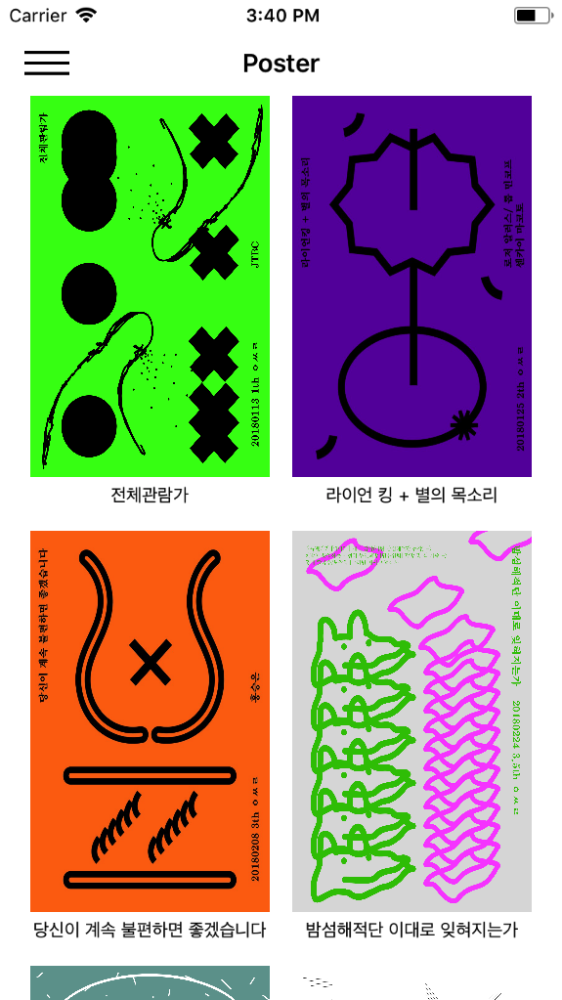

입씨름 Application ver.1.0 (2018.3.31.)
===================

(1) 취지
--------

본 어플리케이션은 어디까지나 ios 개발 연습용으로 제작된 어플리케이션입니다. 앱 스토어 배포 계획은 없습니다.

ios 개발 공부를 처음 시작한 시점에서 교재 아무거나 읽고 구글 검색하고 중구난방으로 정보를 끌어 모으는 과정이 너무 지루해서 일단 뭐가 되었든간에 어플을 한 번 만들어보고자 생각했습니다. 그래서 본인이 고등학교때부터 몸담아온 독서 모임 <입씨름>의 3년 동안의 행적을 정리하는 기념비적인 어플리케이션을 만들어 보았습니다. ios 개발에 대해서 아무것도 모르는 상태로 시작해서 잘 모르는 상태로 완성했습니다.

앱 디자인은 입씨름 멤버인 김시준(https://www.facebook.com/seasoninghello/)군이 전적으로 담당했습니다. 구상이나 제작 과정에서도 많은 도움을 얻었습니다. 제작 과정에서 수많은 google/git 블로그, stack overflow, swift API, 그리고 꼼꼼한 재은씨의 swift 실전편 등을 참고했습니다.

(2) 설명
--------
    
1. BaseViewController, MenuViewController

- 화면 좌측에 표시되는 사이드 바입니다. 만들기가 귀찮았기 때문에 **Ashish Kakkad**의 open-source 프로젝트를 알맞게 수정해서 사용했습니다 *(http://ashishkakkad.com/2015/09/create-your-own-slider-menu-drawer-in-swift)*.
- MenuViewController가 뼈대이며 BaseViewController는 실제 사이드바의 기능과 모습을 조정합니다. 사이드 바를 사용하게 될 뷰는 모두 UIViewController 대신 BaseViewController를 상속받게 됩니다.
- 기본적으로 view는 stack 형식으로 쌓이게 되며 그로 인한 메모리 소모가 엄청나지만 그냥 수정하지 않았습니다.

2. MapViewController, NMapViewResources, FoodData

- 네이버 지도 API를 사용했습니다 *(https://developers.naver.com/docs/map/overview/)*
- 마커를 클릭할 시 FoodData 내에 저장된 맛집 정보가 pop up 됩니다.
- 기본 지도 이외에도 인공위성이나 하이브리드 시점으로 보는 것이 가능하게 상단 바에 버튼을 배치했습니다.

3. About

- <입씨름>과 멤버 소개가 위치한 섹션입니다.
- 변경될 일이 없기 때문에 스토리보드를 사용해서 static하게 구현했습니다.
- 괴물 이미지를 클릭 시 작은 애니메이션이 발생합니다.

4. HistoryCell, HistoryView, BookData

- <입씨름>각 회차의 독서 모임 정보가 기록된 섹션입니다.
- Table View로 구현하였으며, 각 셀을 클릭할 시 BookData 내에 저장된 책 정보가 나옵니다.
- 책 정보가 표시되는 HistoryView를 Modal View로 구현하고 싶었으나 능력과 시간 부족으로 Navigation View로 편하게 구현했습니다

5. Photo, PhotoCell, PhotoData

- <입씨름> 사진들이 기록된 섹션입니다.
- Collection View로 구현하였으며, 각 사진을 클릭할 시 사진이 전체화면으로 바뀌며, 핀치 제스처로 확대 및 저장이 가능합니다.
- 사진 크기는 PhotoData 내부에 있는 원본 사진 비율에 맞춰 화면 내에서 Dynamic하게 조정됩니다. 사실 dynamic layout을 사용하고 싶었지만 실력부족으로 적당하게 구현했습니다.
- 어떻게 해야 할 지 모르겠어서 사진을 일단 어플리케이션 내부에 다 담아놓는 바람에 로딩하는 데 시간이 약간 걸립니다

6. Poster, PosterCell, PosterDataHistory,

- 김시준 군이 제작한 <입씨름> 포스터가 위치한 섹션입니다.
- Collection View로 구현하였으며, 각 포스터를 클릭할 시 포스터가 전체화면으로 바뀝니다.

(3) 한계
---------

- 메모리 소모 및 누수가 엄청납니다
- 사진을 무작정 앱 내에 다 담아놓아서 용량이 큽니다
- 코드가 길고 일관성이 없으며 장황합니다
- design stratage가 전혀 없는 상황에서 제작해서 각각의 모듈이 유기성을 띠지 못하고 그냥 중구난방입니다
- 최대한 피하려고 했으나 몇몇 view 구현에 있어서 storyboard에 의존한 부분이 있습니다
- 시간 부족으로 기존에 기획했던 Reward나 Search와 같은 몇 개 view를 구현하지 못했습니다
- 처음에 프로젝트 이름을 대충 지어가지고 프로젝트 이름이 SejinNaverMap입니다 이름 변경은 포기했습니다

(4) 이후 계획
-------------

인생의 좋은 경험이라고 생각하고 자기계발 및 다른 어플리케이션 개발에 힘쓰겠습니다

*all copyright by 3zin , 김시준*
